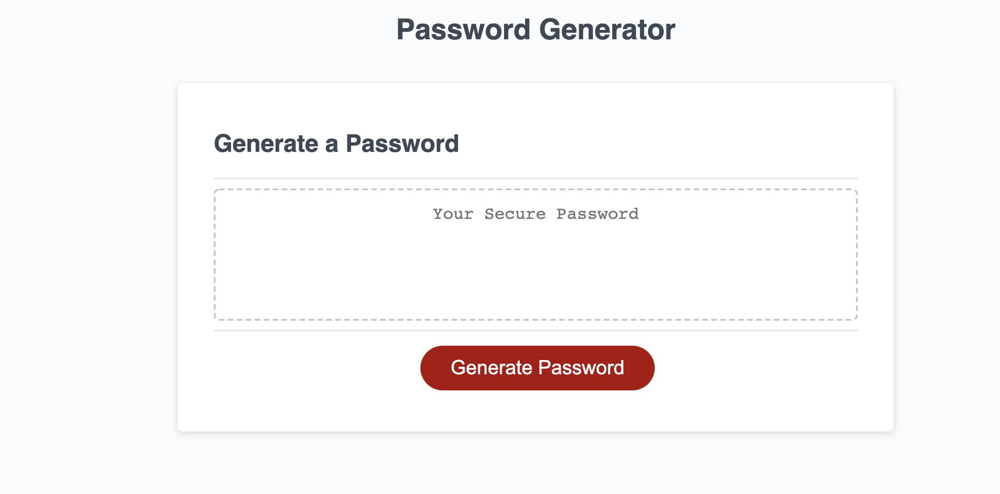

## The custom Quiz

# Purpose
The purpose of this quiz is to test my abilities in javascript through the use of the DOM interface, localstorage and timing events to create a quiz that subtracts time on error and locally saves highscores.(Not all criteria was met.)

# Built With-
This was created using mainly javascript with some css added for detailing and mininal html

# Webpage Link
https://davido1214.github.io/Custom-Quiz/

# Webpage Preview

